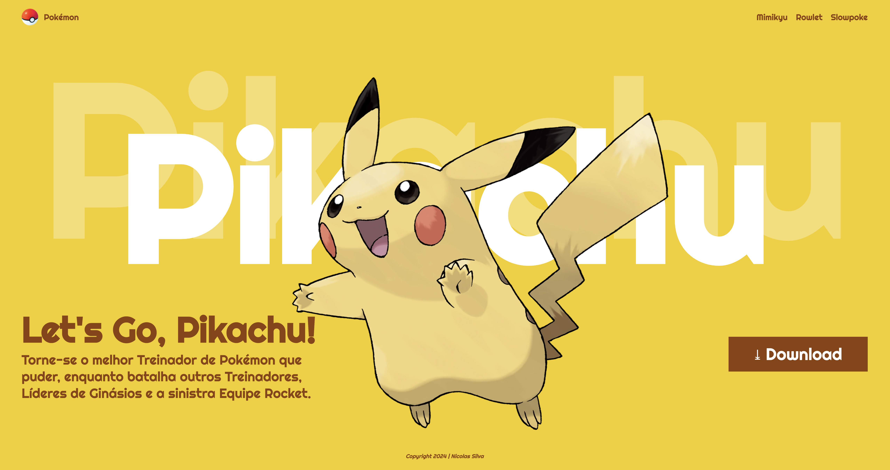

# Landing Page - Let's Go, Pikachu!

---
## Sobre
Site do tipo Landing Page para divulgar o jogo Let's Go, Pikachu. O objetivo deste projeto é colocar em prática os conhecimentos adquiridos sobre as linguagens de marcação HTML, CSS e markdow durante o curso técnico de Desenvolvimento de Sistemas do [SENAI Jandira](https://sp.senai.br/unidade/jandira/).

## Tecnologias utilizadas
- HTML
- CSS
- Markdown
- Git

## Autor

- Nicolas Silva